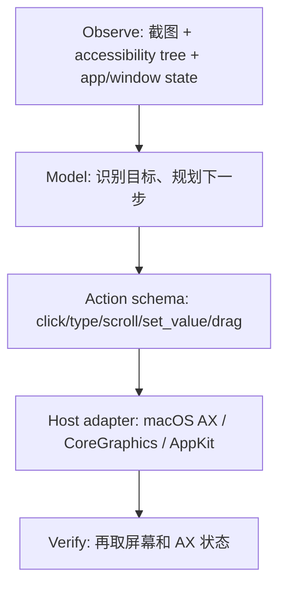

# Codex Computer Use 实现原理分析笔记

> 基于当前仓库中的 `bgclick-rev-skill.md` 进行分析。本文不是 OpenAI 内部实现的直接证明，而是把 skill 暴露的 macOS GUI 自动化线索，映射到 Codex Computer Use 这类能力的可能架构。

## 总体判断

Computer Use 这类能力大概率不是单纯的“模型看截图，然后移动鼠标”。它更像是一个分层系统：



上层由模型理解任务和规划动作；中层把 UI 状态抽象成截图、accessibility tree、窗口状态和可执行动作；底层则调用操作系统 API 完成真实输入、控件赋值、滚动、拖拽和点击。

## skill 暴露出的关键线索

当前 skill 关注的是一个很窄但关键的问题：macOS 上如何点击后台窗口，而不把目标 app 激活到前台。

它指出的核心路径是：

1. 使用 `CGWindowListCopyWindowInfo` 枚举窗口，按 `kCGWindowOwnerPID` 找到目标 app 的窗口。
2. 读取目标窗口的 `CGWindowID`，也就是 `kCGWindowNumber`。
3. 用 `NSEvent mouseEventWithType:location:modifierFlags:timestamp:windowNumber:context:eventNumber:clickCount:pressure:` 构造 AppKit 鼠标事件。
4. 通过 `NSEvent.cgEvent` 拿到 `CGEventRef`。
5. 对 `CGEvent` 写入关键字段，例如按钮编号、鼠标 subtype、目标窗口 ID。
6. 同时设置屏幕坐标和窗口本地坐标。
7. 如果目标 app 在后台，给事件设置 `kCGEventFlagMaskCommand`。
8. 最后通过 `CGEvent.postToPid(pid)` 把事件投递给目标进程。

这条路径的重点是 `postToPid`。它不是把系统鼠标移动到某个地方再点击，而是把一个合成好的事件直接投递给某个 PID。

## 后台点击的关键细节

### 1. 事件投递目标是 PID

skill 明确指出投递机制是：

```swift
CGEvent.postToPid(_ pid: pid_t)
```

这意味着事件可以定向送到目标进程，而不是只能走当前前台 app 的普通输入路径。

### 2. 事件来源是 NSEvent，再转为 CGEvent

skill 认为目标 app 的路径不是直接从零构造 `CGEvent`，而是先构造 `NSEvent`：

```swift
NSEvent.mouseEvent(
    with: type,
    location: point,
    modifierFlags: flags,
    timestamp: timestamp,
    windowNumber: windowNumber,
    context: nil,
    eventNumber: eventNumber,
    clickCount: clickCount,
    pressure: pressure
)
```

然后通过 `event.cgEvent` 取得底层 `CGEvent`。

这么做的好处是 AppKit 会自动填充很多内部字段。skill 特别提醒：`NSEvent.cgEvent` 会自动填充一批字段，不应该重复手写，否则会出现双写或不一致。

### 3. 必须写入窗口相关字段

关键字段包括：

| Field | 含义 | 值 |
| ---: | --- | --- |
| `3` | `kCGMouseEventButtonNumber` | 鼠标按钮，左键为 `0` |
| `7` | `kCGMouseEventSubtype` | 固定值 `3` |
| `91` | `kCGMouseEventWindowUnderMousePointer` | 目标窗口 `CGWindowID` |
| `92` | `kCGMouseEventWindowUnderMousePointerThatCanHandleThisEvent` | 同一个目标窗口 `CGWindowID` |

字段 `91` 和 `92` 很重要。它们告诉 WindowServer / AppKit：这次鼠标事件应该被认为发生在目标窗口上。

### 4. 坐标需要同时处理屏幕坐标和窗口本地坐标

skill 描述的坐标管线是：

1. 使用 `CGEventSetLocation` 写入屏幕坐标。
2. 读取 `CGEvent.location`。
3. 用目标窗口 rect 的 origin 做平移，得到窗口本地坐标。
4. 通过 `CGEventSetWindowLocation` 写入窗口本地坐标。

也就是说，后台点击不只是“点屏幕上的 x/y”。事件里还需要包含目标窗口理解得了的 window-local 坐标。

### 5. 后台 app 需要 flags 技巧

skill 特别强调：当目标 app 在后台时，事件 flags 会设成：

```swift
CGEventFlags.maskCommand
```

对应数值是：

```text
0x00100000
```

这不是 `kCGEventFlagMaskNonCoalesced`。`NonCoalesced` 是 `0x00000100`，两者经常被误认。

skill 对这个字段的解释是：`Command` modifier bit 在这里被用作 WindowServer filter bypass 的技巧。

## 为什么能点击后台窗口但不激活 app

这部分是整个 skill 里最有启发的地方。

普通用户理解里，“点击一个窗口”通常意味着这个窗口所在 app 会被激活。但 skill 指出，这条路径并不调用：

- `activateIgnoringOtherApps:`
- `_AXUIElementSetAttributeValue(kAXFrontmostAttribute, ...)`
- SLS/CGS 私有激活 API

也就是说，它不主动把目标 app 设为前台。

事件通过 `postToPid` 进入目标 app 后，仍然会走正常的 AppKit `sendEvent:` 路径。目标 `NSWindow` 可能因为处理鼠标事件而变成 key window，但目标 app 本身仍然不是 active app。

因此会出现一个看起来有点反直觉的状态：

- 点击器所在 app 仍然是前台 app。
- 目标 app 的窗口可能变 key。
- 目标 app 的 `NSApplicationDidBecomeActiveNotification` 不触发。
- 目标 app 的 `NSApp.isActive` 仍然是 `false`。
- 目标窗口可以收到点击事件。

这解释了为什么自动化系统能“操作后台窗口”，同时又尽量不打断用户当前前台上下文。

## 和 Codex Computer Use 的对应关系

当前 Codex 暴露出来的 Computer Use 工具形态包括：

- `get_app_state`
- `click`
- `type_text`
- `set_value`
- `press_key`
- `drag`
- `scroll`
- `perform_secondary_action`
- `list_apps`

其中 `get_app_state` 的描述很关键：它会返回 app 的 key window 状态、截图和 accessibility tree。

这说明 Computer Use 很可能采用混合观测方式：

| 层 | 作用 |
| --- | --- |
| 截图 | 给模型做视觉识别，处理非标准 UI、自绘 UI、canvas 等 |
| Accessibility tree | 提供稳定的控件结构、文字、角色、可点击元素和 element index |
| App/window state | 确定目标 app、窗口、焦点状态 |
| Action schema | 把模型动作限制在结构化 API 内，例如 click/type/scroll |
| OS adapter | 调用 macOS Accessibility、CoreGraphics、AppKit 等 API 执行动作 |
| Verify loop | 执行后重新截图和读取 AX tree，判断是否成功 |

所以 Computer Use 的能力来源不是单点技术，而是多个层次叠加：

1. 模型负责理解目标和规划动作。
2. 工具层负责把 UI 状态结构化。
3. 动作层负责把模型意图变成 OS 可执行操作。
4. 验证层负责闭环，避免盲点和误操作。

## click 可能有多条执行路径

从工程角度看，一个成熟的 Computer Use 系统不会只有一种点击方式。它可能按场景选择不同路径：

| 路径 | 适用场景 |
| --- | --- |
| Accessibility action | 标准按钮、菜单项、输入框等可访问控件 |
| Accessibility set value | 文本框、可设置属性的控件 |
| 普通坐标点击 | 当前前台窗口、浏览器页面、canvas、自绘控件 |
| `CGEvent.postToPid` | 需要定向投递到特定 app 或后台窗口 |
| 键盘事件 | 快捷键、文本输入、导航 |
| 滚动/拖拽事件 | 列表、画布、滑块、文件拖放等 |

这个 skill 主要解释的是其中最底层、也最容易让人觉得“惊艳”的一条：通过合成 `CGEvent` 并投递到目标 PID，完成后台窗口点击。

## 这对理解 Computer Use 的启发

Computer Use 的本质可以理解为：

> LLM 不是直接控制电脑，而是在一个受限、结构化、可验证的操作系统适配层上，选择下一步动作。

这个适配层把复杂的桌面自动化问题拆成几件事：

1. 看见当前状态。
2. 识别目标 UI 元素。
3. 选择合适的动作 primitive。
4. 调用系统 API 执行。
5. 再次观察，确认结果。

其中 macOS 底层能力大致来自：

- Accessibility API：读取 UI tree、触发控件动作、设置控件值。
- CoreGraphics：截图、窗口枚举、事件合成、事件投递。
- AppKit：构造和解释 `NSEvent`，处理窗口/key window 行为。
- TCC 权限：控制屏幕录制、辅助功能、输入监控等安全边界。

## 一句话总结

Codex Computer Use 的上层是 LLM 规划和 UI 理解；中层是截图、accessibility tree 和结构化动作接口；底层在 macOS 上很可能混合使用 Accessibility、CoreGraphics 和 AppKit。

当前 skill 揭示的是其中一个关键底层机制：通过 `NSEvent -> CGEvent -> postToPid`，再配合窗口 ID、屏幕坐标、窗口本地坐标和 flags 修正，实现对后台 app 的定向事件投递。
